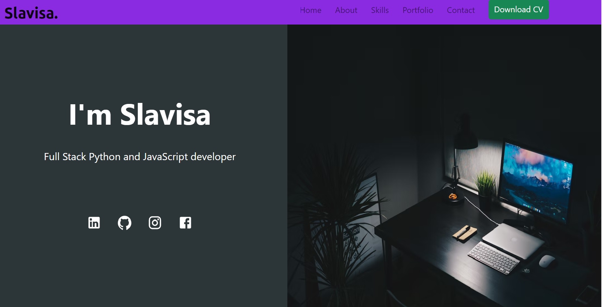

# My Portfolio Built with ReactJS

## [Slavisa Petrovic Live Version](https://slavisa-petrovic.netlify.app)

 
 

  

 
 

    My personal portfolio is made by improving technologies to implement modern web concepts which includes JS & React and lots add on libraries what is based on my current skills.

    Also through my portforio there's a bunch of projects based on Python and JS skills.

## This project was built using these technologies
   

* React.js
* CSS3
* HTML5
* EmailJS
* framer-motion
* VsCode
* Git/GitHub

 

### Features
 

📖 Multi-Page Layout

🎨 Styled with React-Bootstrap, ui-materials and CSS3

🎬 Animated wih framer-motion

📱 Fully Responsive

⏩ React-Form, React useState, useEffect, useReff Hooks

⚡️ Well organized documentation

 

# Setup
## Get the code

    git clone https://github.com/cheroboolo/ReactPortfolio.git

## Install required dependencies
 

* ### `npm install`

 

## Available Scripts
 

In the project directory, you can run:

* ### `npm start`

Runs the app in the development mode.\
Open [http://localhost:3000](http://localhost:3000) to view it in your browser.

The page will reload when you make changes.\
You may also see any lint errors in the console.

* ### `npm test`

Launches the test runner in the interactive watch mode.\
See the section about [running tests](https://facebook.github.io/create-react-app/docs/running-tests) for more information.

* ### `npm run build`

Builds the app for production to the `build` folder.\
It correctly bundles React in production mode and optimizes the build for the best performance.

The build is minified and the filenames include the hashes.\
Your app is ready to be deployed!

See the section about [deployment](https://facebook.github.io/create-react-app/docs/deployment) for more information.

## Learn More

You can learn more in the [Create React App documentation](https://facebook.github.io/create-react-app/docs/getting-started).

To learn React, check out the [React documentation](https://reactjs.org/).

 

## Ideas for future improvements

### This project as any other have always space for improvements.
    I use a lot ideas to practice and upgrade my skills.
    
* UX/Ui
* Solid Principles
* More React Options and variations for better interaction with visitor.

